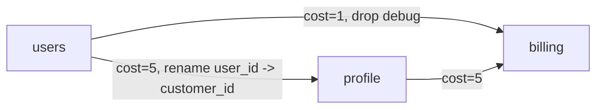
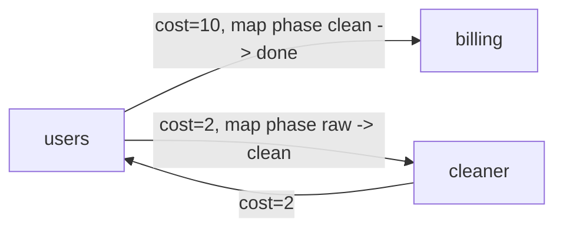

# Красный уровень: шлюз сообщений

В Центральном университете много внутренних сервисов, и каждый из них принимает JSON-сообщения в своём формате.

Например, один сервис отправляет поле `user_id`, другой ждёт `customer_id`, третий хранит приоритет числом, а четвёртый хочет строку `"high"`. Чтобы сервисы могли общаться друг с другом, используется шлюз сообщений.

Шлюз хранит карту адаптеров. Каждый адаптер переводит сообщение из формата одного сервиса в формат другого: переименовывает поля, добавляет значения по умолчанию, заменяет значения по таблице или удаляет лишние поля.

Ваша задача — реализовать шлюз, который по текущей карте адаптеров находит лучший маршрут для сообщения и возвращает результат преобразования.

## Идея

Допустим, есть три сервиса:

```text
admission -> profile -> billing
```

Сообщение пришло из `admission`, а нужно получить сообщение для `billing`.

Адаптер `admission -> profile` может переименовать поле `user_id` в `customer_id`.

Адаптер `profile -> billing` может добавить поле `source`.

Тогда сообщение можно провести по маршруту:

```text
admission -> profile -> billing
```

и последовательно применить оба адаптера.

Наглядно это можно представить как ориентированный граф:


Формально сервисы — это вершины графа, а адаптеры — направленные рёбра.

## Формальная модель

Есть ориентированный граф.

Вершина графа — сервис.

Ребро графа — адаптер из одного сервиса в другой.

Каждый адаптер содержит:

- исходный сервис;
- целевой сервис;
- положительную стоимость;
- список операций над сообщением.

Граф может содержать циклы. Маршрут может проходить через один и тот же сервис несколько раз.

Например, маршрут может выглядеть так:

```text
users -> cleaner -> users -> billing
```

Это может быть полезно: сначала сообщение проходит через `cleaner`, там удаляется лишнее поле, после чего из `users` становится возможен переход в `billing`.

Для любой упорядоченной пары сервисов существует не более одного адаптера. То есть не бывает двух разных адаптеров с одинаковыми `from` и `to`.

## API

Решение должно реализовать три HTTP-метода.

Все запросы обрабатываются последовательно.

### `GET /health`

Метод нужен, чтобы тестер мог понять, что сервер запущен и готов принимать запросы.

Запрос не содержит тела.

Ответ:

```json
{
  "status": "ok"
}
```

Метод не должен менять текущую карту адаптеров.

### `POST /configure`

Метод полностью заменяет текущую карту адаптеров.

Запрос:

```json
{
  "adapters": [
    {
      "from": "admission",
      "to": "profile",
      "cost": 3,
      "operations": [
        {
          "op": "rename",
          "from": "user_id",
          "to": "customer_id"
        }
      ]
    }
  ]
}
```

Ответ:

```json
{
  "status": "ok"
}
```

Если `/configure` вызывается несколько раз, новая конфигурация полностью заменяет старую.

После успешного ответа на `/configure` все последующие запросы `/route` должны использовать новую карту адаптеров.

### `POST /route`

Метод получает исходный сервис, целевой сервис и сообщение.

Запрос:

```json
{
  "from": "admission",
  "to": "billing",
  "message": {
    "user_id": "42",
    "priority": 1,
    "debug": true
  }
}
```

Если подходящий маршрут найден, нужно вернуть:

```json
{
  "status": "routed",
  "path": ["admission", "profile", "billing"],
  "message": {
    "customer_id": "42",
    "priority": "high"
  },
  "lost_fields": ["debug"],
  "cost": 7
}
```

Если применимого маршрута нет, нужно вернуть:

```json
{
  "status": "incompatible",
  "reason_code": "NO_APPLICABLE_PATH"
}
```

Если `from == to`, допустим маршрут из одного сервиса без адаптеров. В этом случае сообщение не меняется, стоимость равна `0`, список потерянных полей пустой.

## Сообщения

Сообщение — это JSON-объект.

Поля находятся только на верхнем уровне. Вложенных объектов и массивов нет.

Значение поля может быть одним из типов:

```text
string
number
boolean
null
```

Все входные JSON-объекты и конфигурации корректны по схеме. Не нужно обрабатывать невалидный JSON, неизвестные операции или отсутствующие обязательные поля в запросах.

## Getting started

Этот раздел не добавляет новых правил к условию. Это короткий чеклист, с которого удобно начать реализацию.

1. Сделайте HTTP-сервер на любом удобном языке. Для Python в папке `for_practicant` уже есть минимальная Flask-заготовка.
2. Сервер должен слушать порт, который вы будете передавать тестеру. Обычно удобно использовать `8080`.
3. Добавьте `GET /health`, который возвращает `{"status": "ok"}`.
4. В обработчике `POST /configure` нужно прочитать JSON, сохранить список `adapters` в памяти и вернуть ровно `{"status": "ok"}`.
5. В обработчике `POST /route` нужно прочитать `from`, `to` и `message`, найти ответ по текущей конфигурации и вернуть JSON в одном из двух форматов из раздела API.
6. Сначала проверьте простые случаи: пустая конфигурация, `from == to`, один адаптер без операций.
7. Затем добавляйте операции `rename`, `default`, `map`, `drop` и проверяйте, что адаптер целиком отбрасывается, если одна из его операций неприменима.
8. После этого переходите к выбору лучшего маршрута по правилам из раздела «Выбор маршрута».

### Публичный тестер

В папке `for_practicant` лежит стартовый комплект:

- `server.py` — минимальная Flask-заготовка с ручками `/health`, `/configure` и `/route`;
- `requirements.txt` — зависимость для запуска Flask-заготовки;
- `public_tests.json` — набор публичных тестов с конфигурациями, запросами и ожидаемыми ответами;
- `tester.py` — Python-скрипт, который читает этот JSON, отправляет запросы в ваше решение и сравнивает ответы.

Сначала установите зависимость и запустите заготовку:

```bash
cd for_practicant
python3 -m pip install -r requirements.txt
python3 server.py
```

В заготовке стоят TODO-ответы. Они нужны только как каркас HTTP-контракта; публичные тесты начнут проходить только после реализации `/configure` и `/route`.

Если сервер слушает `http://localhost:8080`, в другом терминале запустите:

```bash
cd for_practicant
python3 tester.py --url http://localhost:8080
```

Можно запустить только один публичный блок:

```bash
python3 tester.py --url http://localhost:8080 --case public_ops
```

Эти тесты не являются полным набором проверок и не гарантируют прохождение скрытых тестов. Они нужны, чтобы быстро проверить формат HTTP-ответов, базовые преобразования, неприменимые маршруты и несколько маршрутов с циклами.

## Операции адаптера

Операции внутри адаптера выполняются строго в указанном порядке.

Если хотя бы одна операция адаптера неприменима, весь адаптер считается неприменимым. В таком случае маршрут через этот адаптер нужно отбросить.

### `rename`

Переименовывает поле.

```json
{
  "op": "rename",
  "from": "user_id",
  "to": "customer_id"
}
```

Правила:

- если поля `from` нет, адаптер неприменим;
- если поле `to` уже есть, адаптер неприменим;
- иначе значение переносится из поля `from` в поле `to`, а поле `from` удаляется.

Пример:

```json
{
  "user_id": "42"
}
```

после операции становится:

```json
{
  "customer_id": "42"
}
```

### `default`

Добавляет значение по умолчанию.

```json
{
  "op": "default",
  "field": "source",
  "value": "legacy"
}
```

Правила:

- если поля `field` нет, оно добавляется со значением `value`;
- если поле уже есть, сообщение не меняется;
- операция всегда применима.

### `map`

Заменяет значение поля по таблице.

```json
{
  "op": "map",
  "field": "priority",
  "values": [
    {
      "from": 0,
      "to": "normal"
    },
    {
      "from": 1,
      "to": "high"
    }
  ]
}
```

Правила:

- если поля `field` нет, адаптер неприменим;
- если текущее значение поля не встречается среди значений `from`, адаптер неприменим;
- иначе значение поля заменяется на соответствующее значение `to`.

В одной операции `map` все значения `from` различны (с учётом JSON-типа).

Сравнение значений происходит с учётом JSON-типа. Например, строка `"1"` и число `1` считаются разными значениями. Числа сравниваются как JSON `number`, а не как текст: `1`, `1.0` и `1.00` — одно и то же значение.

### `drop`

Удаляет поле.

```json
{
  "op": "drop",
  "field": "debug"
}
```

Правила:

- если поле есть, оно удаляется, а имя поля добавляется в `lost_fields`;
- если поля нет, сообщение не меняется;
- операция всегда применима.

Если одно и то же поле удаляется несколько раз в разных местах маршрута, каждое удаление добавляется в `lost_fields` отдельно.

Порядок элементов в `lost_fields` — порядок фактических удалений при прохождении маршрута.

## Выбор маршрута

Шлюз должен выбрать один лучший применимый маршрут.

Главная цель шлюза — сохранить как можно больше данных. Поэтому маршрут, который теряет меньше полей, всегда лучше, даже если его стоимость больше. Стоимость используется только для выбора среди маршрутов с одинаковым числом потерь.

Маршруты сравниваются по критериям в таком порядке:

1. меньше количество потерянных полей, то есть `lost_fields.length`;
2. меньше суммарная стоимость адаптеров;
3. меньше количество адаптеров в маршруте;
4. лексикографически меньше список сервисов `path`.

Следующий критерий используется только если все предыдущие равны.

Лексикографическое сравнение `path` — поэлементное: списки сравниваются по первому различающемуся элементу, а имена сервисов сравниваются как строки (посимвольно по кодам символов). Если один список является префиксом другого, меньшим считается более короткий. Например, `"s10" < "s2"`, потому что символ `'1'` меньше `'2'`.

Стоимость маршрута — сумма `cost` всех адаптеров в нём.

Количество адаптеров в маршруте равно `path.length - 1`.

Благодаря последнему критерию и запрету нескольких адаптеров между одной и той же парой сервисов оптимальный ответ единственный.

## Пример

Пусть текущая конфигурация такая:

```json
{
  "adapters": [
    {
      "from": "users",
      "to": "billing",
      "cost": 1,
      "operations": [
        {
          "op": "drop",
          "field": "debug"
        }
      ]
    },
    {
      "from": "users",
      "to": "profile",
      "cost": 5,
      "operations": [
        {
          "op": "rename",
          "from": "user_id",
          "to": "customer_id"
        }
      ]
    },
    {
      "from": "profile",
      "to": "billing",
      "cost": 5,
      "operations": []
    }
  ]
}
```

Граф:



Запрос:

```json
{
  "from": "users",
  "to": "billing",
  "message": {
    "user_id": "42",
    "debug": true
  }
}
```

Есть два маршрута.

Первый маршрут:

```text
users -> billing
```

После него сообщение:

```json
{
  "user_id": "42"
}
```

Потерянные поля:

```json
["debug"]
```

Стоимость:

```text
1
```

Второй маршрут:

```text
users -> profile -> billing
```

После него сообщение:

```json
{
  "customer_id": "42",
  "debug": true
}
```

Потерянные поля:

```json
[]
```

Стоимость:

```text
10
```

Выбирается второй маршрут, потому что он не теряет поля. Потери важнее стоимости.

Ответ:

```json
{
  "status": "routed",
  "path": ["users", "profile", "billing"],
  "message": {
    "customer_id": "42",
    "debug": true
  },
  "lost_fields": [],
  "cost": 10
}
```

## Пример с циклом

Иногда лучший маршрут может вернуться в уже посещённый сервис.

Пусть есть такой граф (значения в скобках — операции адаптера):



То есть:

- `users -> billing` содержит `map` поля `phase`: `clean -> done`;
- `users -> cleaner` содержит `map` поля `phase`: `raw -> clean`;
- `cleaner -> users` не содержит операций.

Пусть в сообщении `phase = "raw"`.

Маршрут напрямую `users -> billing` неприменим: в таблице `map` нет значения `raw`, поэтому адаптер неприменим.

Но можно пройти так:

```text
users -> cleaner -> users -> billing
```

Сначала `users -> cleaner` заменит `phase` с `raw` на `clean`, потом сообщение вернётся в `users`, после чего адаптер `users -> billing` станет применимым (`phase = "clean"`) и заменит `phase` на `done`.

## Проверка ответа

Каждый запрос `/route` проверяется бинарно: ответ либо совпадает с эталонным, либо считается неправильным.

Если существует применимый маршрут, участник должен вернуть именно оптимальный маршрут по правилам выше.

Если применимого маршрута нет, участник должен вернуть `NO_APPLICABLE_PATH`.

Порядок ключей в JSON-объектах не важен.

Порядок элементов в массивах `path` и `lost_fields` важен.

## Ограничения

Все запросы обрабатываются последовательно.

Все стоимости адаптеров — положительные целые числа, не превышающие $10^6$.

Имена сервисов и полей — строки до `64` символов из латинских букв, цифр и `_`.

Строковые значения полей — до `256` символов. Числовые значения — целые или дробные в диапазоне double.

Для любой упорядоченной пары `(from, to)` в конфигурации не более одного адаптера.

Размеры тестов зависят от группы:

| Группа | Сервисы `S` | Адаптеры `A` | Поля `F` | Операции в адаптере `O` | Запросы `/route` на один `/configure` |
| --- | ---: | ---: | ---: | ---: | ---: |
| Маленький граф без циклов, без операций | ≤ 10 | ≤ 30 | ≤ 10 | 0 | ≤ 200 |
| Маленький граф без циклов, с операциями | ≤ 10 | ≤ 30 | ≤ 10 | ≤ 5 | ≤ 200 |
| Маленький граф с циклами | ≤ 8 | ≤ 20 | ≤ 6 | ≤ 5 | ≤ 200 |
| Средний граф без циклов | ≤ 50 | ≤ 500 | ≤ 15 | ≤ 5 | ≤ 500 |
| Средний граф с циклами | ≤ 30 | ≤ 300 | ≤ 8 | ≤ 5 | ≤ 200 |
| Большой граф без циклов | ≤ 1000 | ≤ 20000 | ≤ 20 | ≤ 5 | ≤ 200 |
| Большой граф с циклами | ≤ 300 | ≤ 3000 | ≤ 8 | ≤ 5 | ≤ 200 |

Для групп с циклами дополнительно ограничено множество значений, которые вообще встречаются в тесте. Все значения из исходного сообщения, из `value` в операциях `default`, а также из `from` и `to` в операциях `map`, принадлежат одному общему набору значений размера не более `5` на тест.

Ограничение задаётся именно через общий набор, а не «на каждое поле»: операция `rename` переносит значение из одного поля в другое, поэтому ограничивать число значений отдельного поля недостаточно. Так как ни одна операция не создаёт значений вне этого набора, любое поле в любой момент содержит значение из набора, и множество достижимых сообщений конечно.

Кроме того, во всех группах тестовые данные устроены так, что число различных достижимых состояний `(сервис, сообщение)` на один запрос `/route` невелико. Гарантируются следующие верхние границы:

| Группа | Достижимых состояний на запрос `≤` |
| --- | ---: |
| Маленькие группы | 5 000 |
| Средние группы | 50 000 |
| Большие группы | 200 000 |

Это и задаёт целевой алгоритм: поиск оптимального по критериям выше маршрута в пространстве состояний `(сервис, сообщение)`. Большие группы проверяют в первую очередь масштаб графа (число сервисов и адаптеров), а не комбинаторный взрыв сообщений.

Ограничение времени:

- не более `3` секунд на отдельный HTTP-запрос;
- не более `40` секунд суммарно на один `/configure` вместе со всей серией последующих `/route`.

## Подзадачи и оценивание

Всего: 30 баллов.

| Группа | Баллы | Ограничения |
| --- | ---: | --- |
| Маленький граф без циклов, без операций | 4 | Все `operations: []`. Нужно найти маршрут или вернуть `NO_APPLICABLE_PATH`. |
| Маленький граф без циклов, с операциями | 4 | Есть операции `rename`, `default`, `map`, `drop`. |
| Маленький граф с циклами | 4 | Граф может содержать циклы. Лучший маршрут может проходить через сервис несколько раз. |
| Средний граф без циклов | 6 | Больше сервисов, адаптеров и альтернативных маршрутов. |
| Средний граф с циклами | 6 | Есть циклы и повторные посещения сервисов. |
| Большой граф без циклов | 3 | Проверяется производительность на большом ациклическом графе. |
| Большой граф с циклами | 3 | Большой граф с циклами и повторными посещениями сервисов. |

## Ветки

Базовая ветка задания — `main`; она защищена. Для сдачи создайте ветку `dev` и пушьте решение туда. CI запускается только для `dev`.
